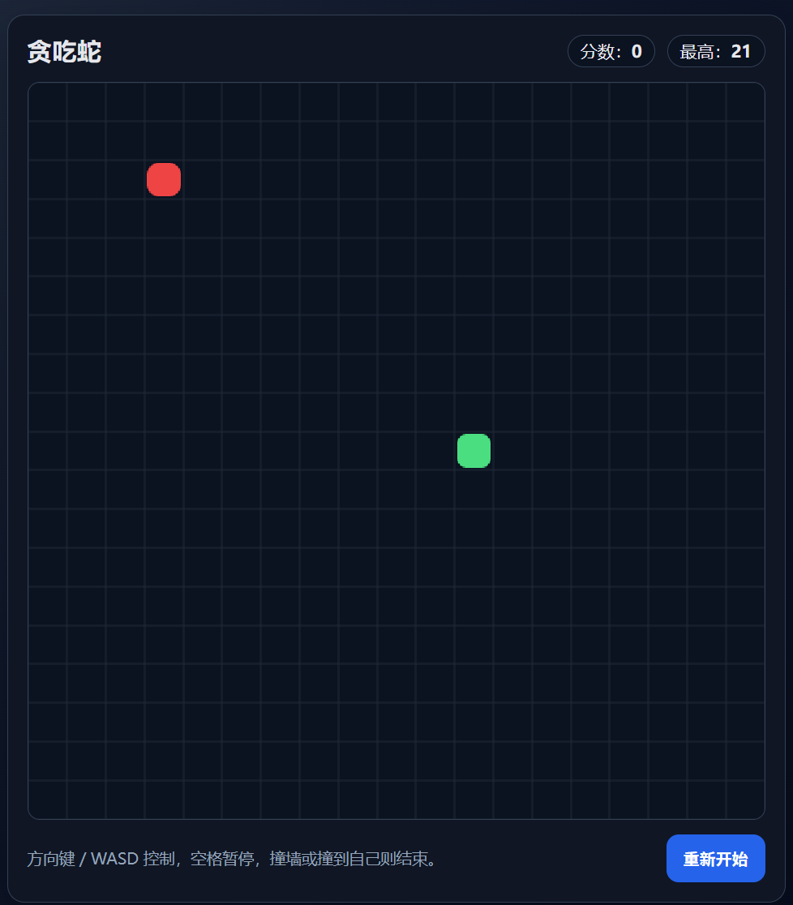

# 贪吃蛇（Snake Game）

一个基于 **HTML + CSS + JavaScript** 的单文件贪吃蛇小游戏，开箱即玩，无需安装任何依赖。



## 游戏介绍

这是一个经典的贪吃蛇实现：

- 你控制绿色小蛇在网格中移动
- 吃到红色食物后长度增加、分数提升
- 随着得分增加，移动速度会逐步提升
- 撞到边界或撞到自己即游戏结束

界面采用深色科技风设计，包含实时分数、最高分记录与一键重开按钮，适合用来练习前端基础与 Canvas 动画逻辑。

## 功能特性

- 单文件实现（`index.html`）
- 键盘控制（方向键 / WASD）
- 暂停与继续（空格键）
- 分数统计与最高分持久化（`localStorage`）
- 游戏结束提示与快速重开

## 操作说明

- **移动**：方向键 或 `W/A/S/D`
- **暂停/继续**：空格键
- **重新开始**：点击页面右下角“重新开始”按钮

## 本地运行

1. 克隆仓库：

```bash
git clone https://github.com/dalaoplan/snake_claudetext.git
```

2. 进入目录并直接打开 `index.html`（双击即可），或使用任意静态服务器启动。

## 项目结构

```text
.
├── index.html      # 游戏主文件（包含样式与逻辑）
└── fig/
    └── demo.png    # 游戏界面截图
```

## 适合人群

- 想快速体验网页小游戏开发的初学者
- 想练习 Canvas、事件处理与游戏循环逻辑的前端开发者
- 需要一个可直接二次开发的小型示例项目
